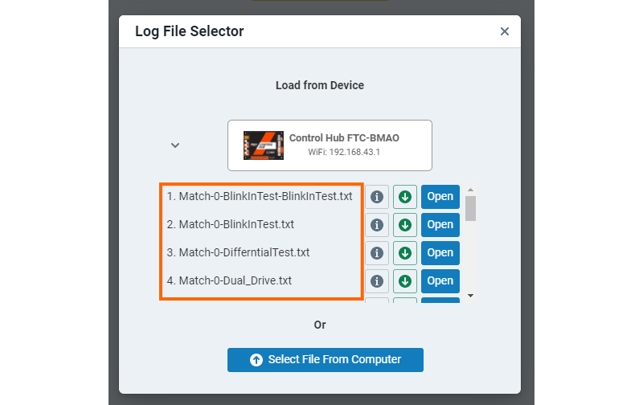
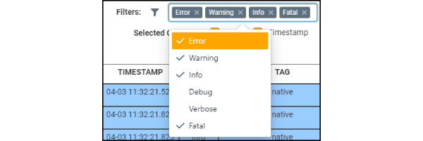
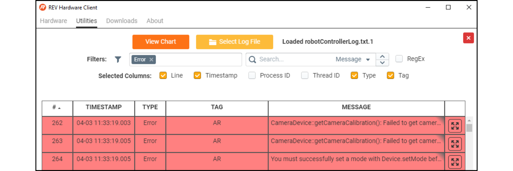
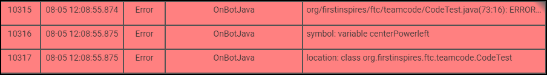
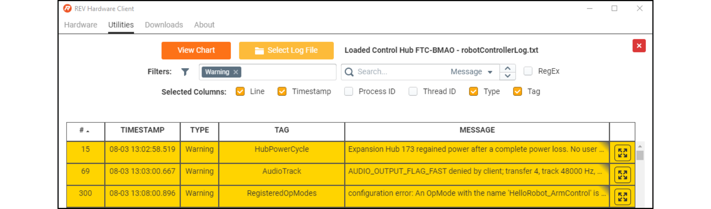
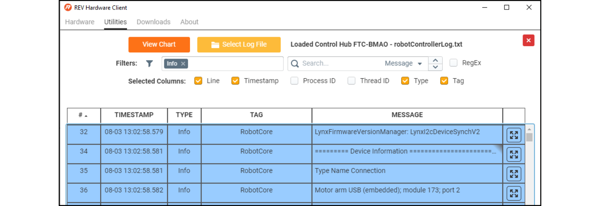
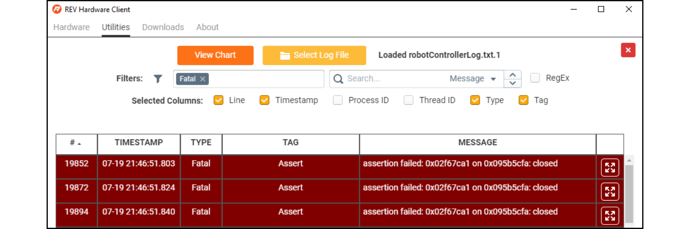
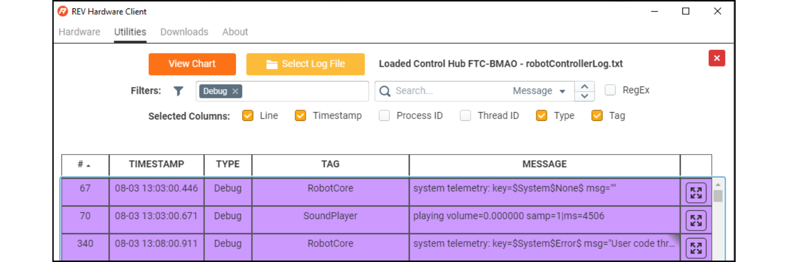
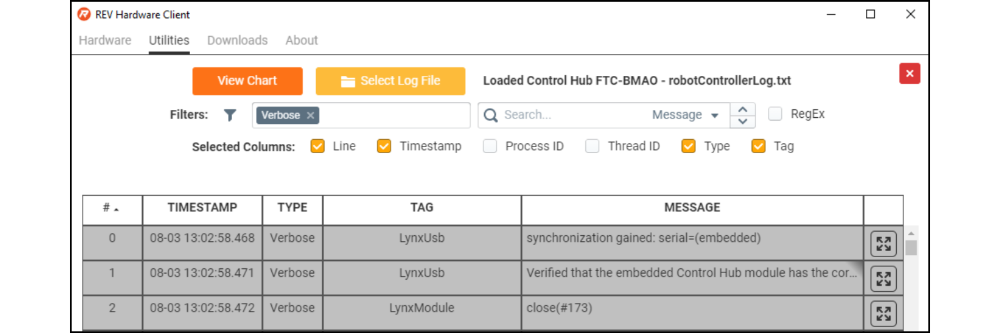

# Using the Log Viewer

When troubleshooting problems with the REV Control System log files provide indicators of what the status of the Control Hub or Expansion Hub were during an event. A look at the Robot Controller,  WiFi log, or Updater log may help you better understand the root cause of the issue. 

However the logs document all activities that the Control System performs, not just issues, but normal startup procedures or op mode runs. The means that logs often contain more information than can be reasonably sifted through. To make the content in the logs more palatable to sort through, the logs need to be parsed. 

The REV Hardware Client has a Log Viewer that makes it easier to parse overall log files. Through a series of filters, tags, and a search function makes it easy to see what is happening on the Control Hub or Driver Hub during any opmode run.

## Accessing the Log Viewer

To access the Log Viewer, head to the Utilities Tab.

From there you can select and open log files for connected devices or for ones downloaded onto the computer. 

## Parsing the Logs

One of the most common issues that arises when trying to interpret logs is the wrong time and date on the Driver Hub or Driver Station phones. Ensuring that your Driver Station is set to the right time before observing or sending a log can help make data between the Robot Controller Log and Driver Station more interpretable. It also helps when observing a unique issue to pay attention to the time of the incident. If a problem or an indicator of a problem starts occurring at 4:38:57 PM then that time can be tracked in the logs to help determine what happened that initiated the issues.

Once you have confirmed the correct date and time you can use the Log Viewer to try to track the problem within the logs. 

If you select a connected device, such as a Control Hub, the Log viewer will give you an option to select standard logs or matches. Matches are segments of the robot controller log where a particular op mode is running. This is helpful to parse the data further by limiting the content to particular op mode runs that you know a system failure occurred during. 

### Interpreting Filters

Aside from helping parse data down to specific time intervals the Log Viewer offers filters to select narrow down data in the logs to a particular type of data. The Log Viewer splits the data from the logs into six types: error, warning, info, fatal, debug, and verbose. 

#### Errors 

Errors occur when system actions do not execute properly. These log lines are typically indicative of a user created issues, such as errors in code, configuration, or wiring. For instance, in the image above the error is stating that it failed to calibrate the camera, which could be a sign that the USB Camera was detached from the Control Hub. 

Another common error you might see are compilation errors. These particular errors are the same error messages you receive in OnBot Java when you attempt to Build code and it fails. 

#### Warnings

When something none fatal occurs in the system, the system sends warning messages. Instances that warrant a warning message, do not cause the Control System to fail, but may cause unexpected behavior. This could be a warning about mismatched versions between the Robot Controller and Driver Station applications, or a warning that your Control System is not receiving enough power to function. 

#### Info

Info messages communication information that my be worthwhile to know for troubleshooting but not necessarily indicative of an issue. This is information like, when a program is initialized, started, or stopped. 

#### Fatal

Like Errors, Fatal actions occur when something within the system does not execute properly. However, fatal actions are indicative that something more severe is happening in a system. If you are having an issues and notice a lot of instances of the fatal data type, please send your [diagnostic data to REV,](https://docs.revrobotics.com/rev-control-system/managing-the-control-system/downloading-log-file#rev-hardware-client) with information on the issue you are having and the status LED behavior.

#### Debug

The debug filter, showcases instances within the logs where debugging functions built into the SDK are performing their jobs. The Log Viewer defaults to filtering out debug information, as the information is typically not needed for troubleshooting. 

#### Verbose

Many of the log types we have discussed thus far provide the insight needed to troubleshoot an issue. However, the logs track much more information than what falls in the other categories. The verbose log type covers the rest of the information included in the logs. This information is typically recording normal system behaviors that do not provide much insight to a problem. 

