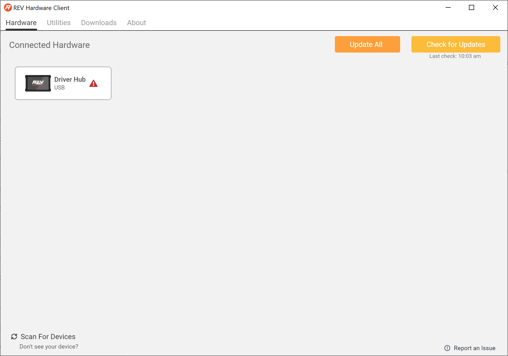

# Connecting a Driver Hub

## Via USB-C

| Steps |
| :--- |
| Turn on the Driver Hub. |
| Plug the Driver Hub into your PC using at USB-A to USB-C Cable. \([REV-11-1232](https://www.revrobotics.com/rev-11-1232/)\) |
| Startup the REV Hardware Client. Once the Driver Hub is on and fully connected it will show up on the front page of the UI under the Hardware Tab. Select Driver Hub. |


If your Driver Hub is showing a battery charging symbol when plugged in via USB it is not turned on and will be unable connect to the REV Hardware Client. 


