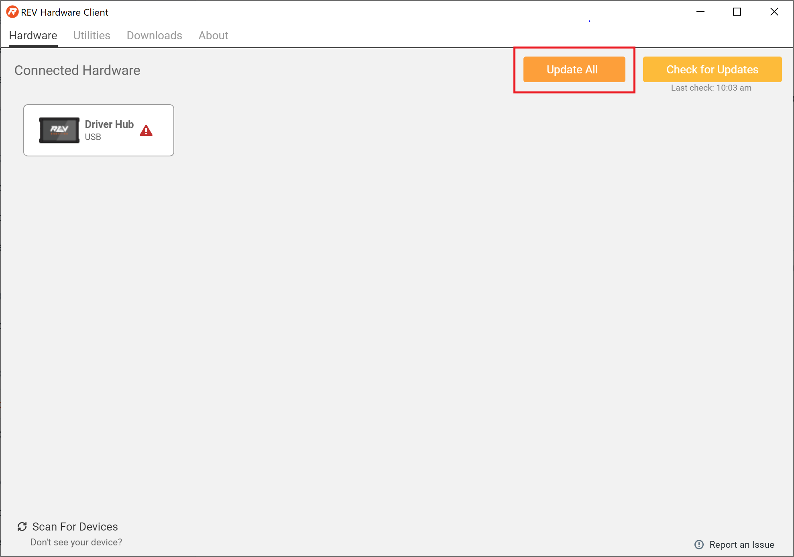
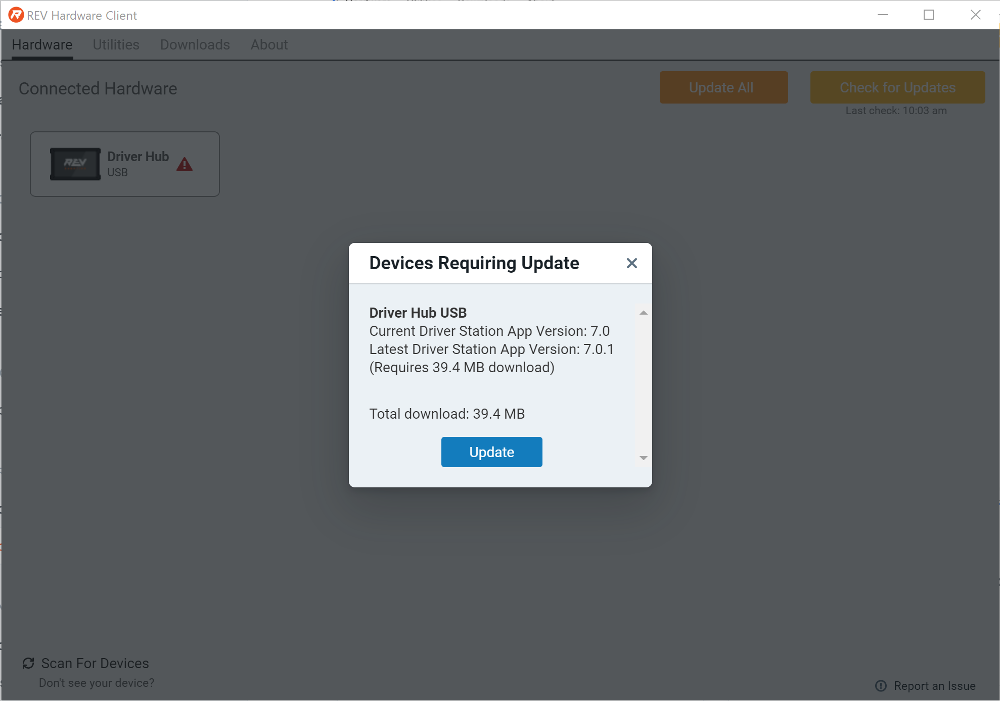
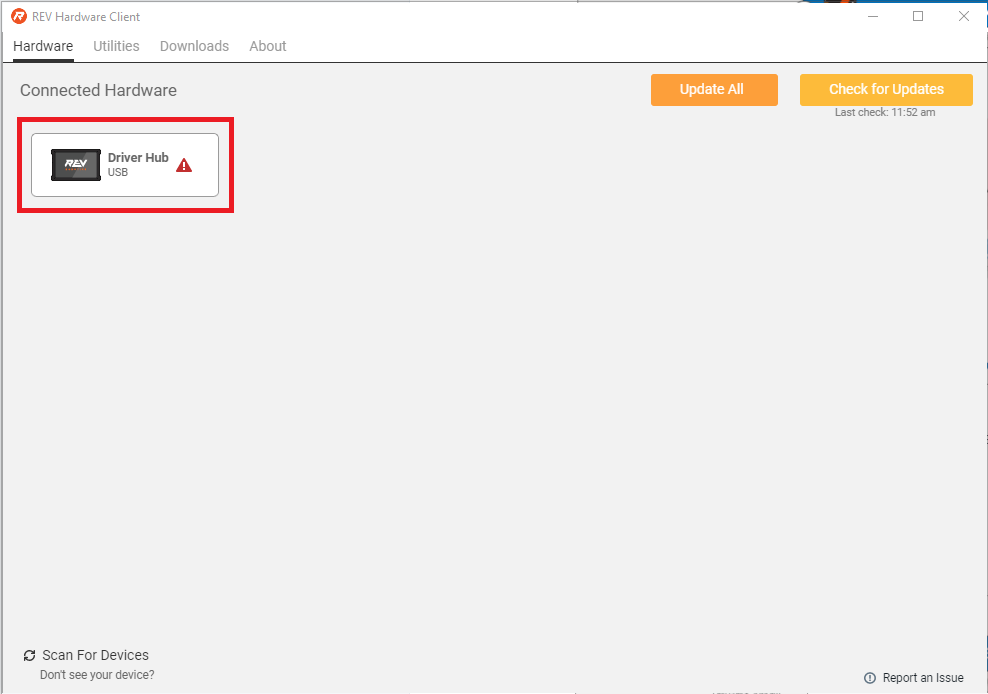
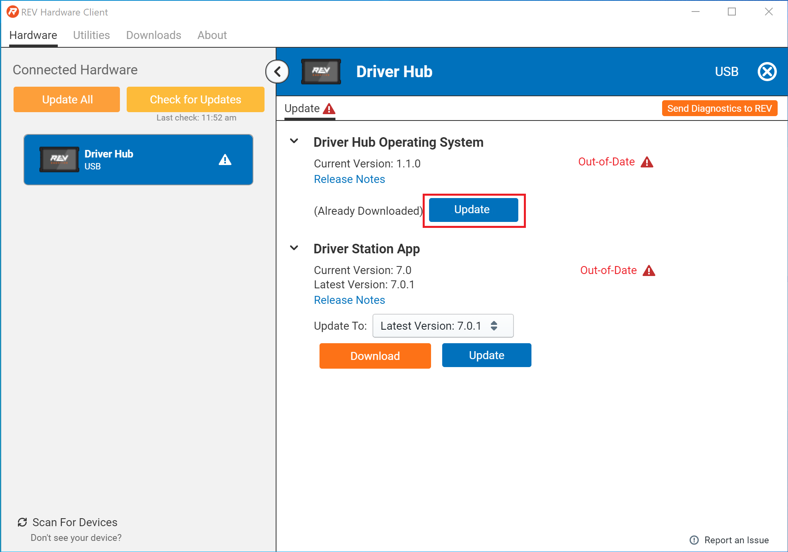
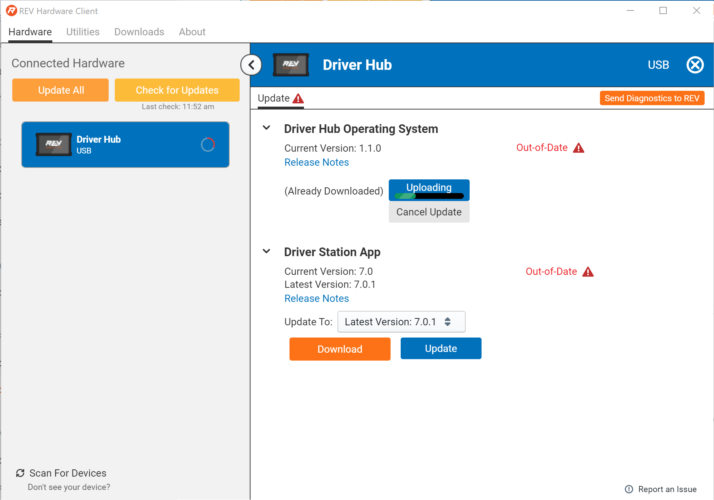
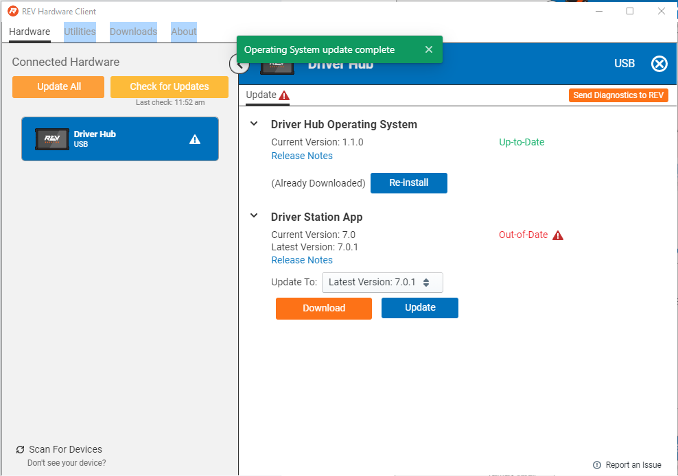
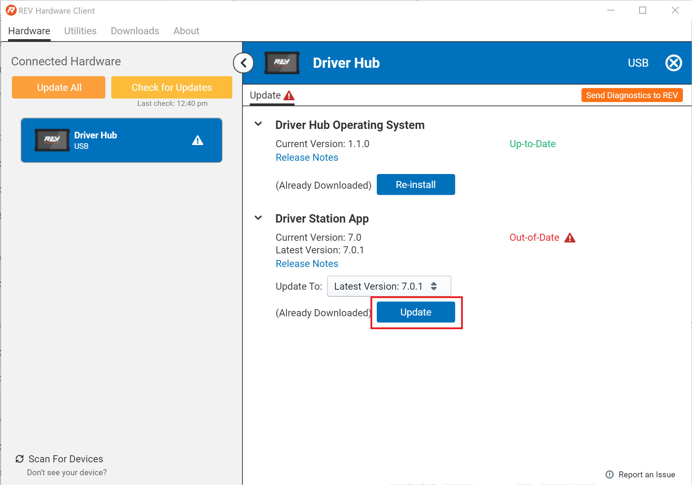
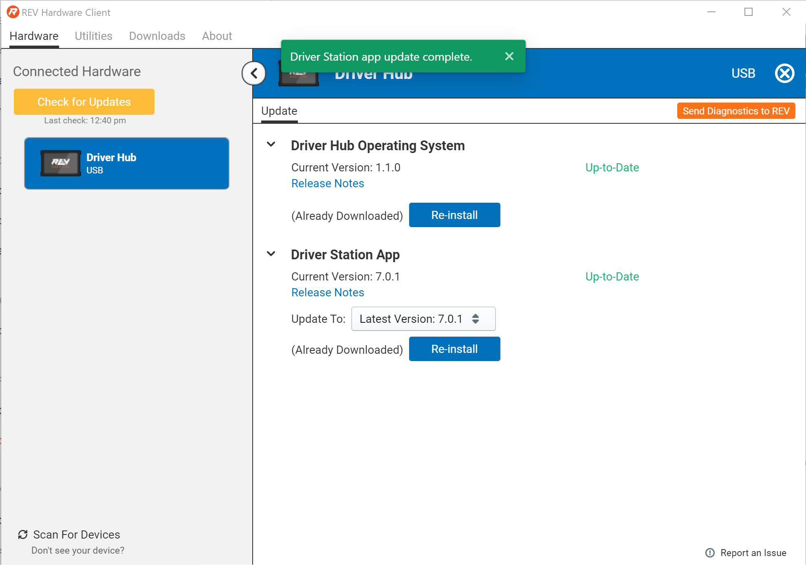

# Updating a Driver Hub

## Update All

When the Driver Hub and any other supported REV Hardware devices that require updates are connected the Update All button will appear. 

Once Update All is is selected the REV Hardware Client will confirm the updates for all connected devices. Select Update to download and update all devices. 

## Individual Updates

To install individual updates to you Driver Hub select the Driver Hub from the list of devices on the Hardware Tab. This will bring up the Update Tab.

### Driver Hub Operating System

After the Update Tab opens, select Download under Driver Hub Operating System \(OS\) to begin downloading the update.

Once the OS update has downloaded select Update.

Keep the Driver Hub powered on and connected to the PC while the update finishes.

When the Driver Station Operating System update has completed a status message "Operating System update complete." The status of the Driver Station OS will also change to "Up-to-Date."

### Driver Station Application 

After selecting the Connected Hardware the Update tab will pop up.  Under ****Driver Station App select Download.

Once the app has downloaded, select Update. 

When the Driver Station Application update has completed a status message "Driver Station App update complete." The status of the Driver Station App will also change to "Up-to-Date."

